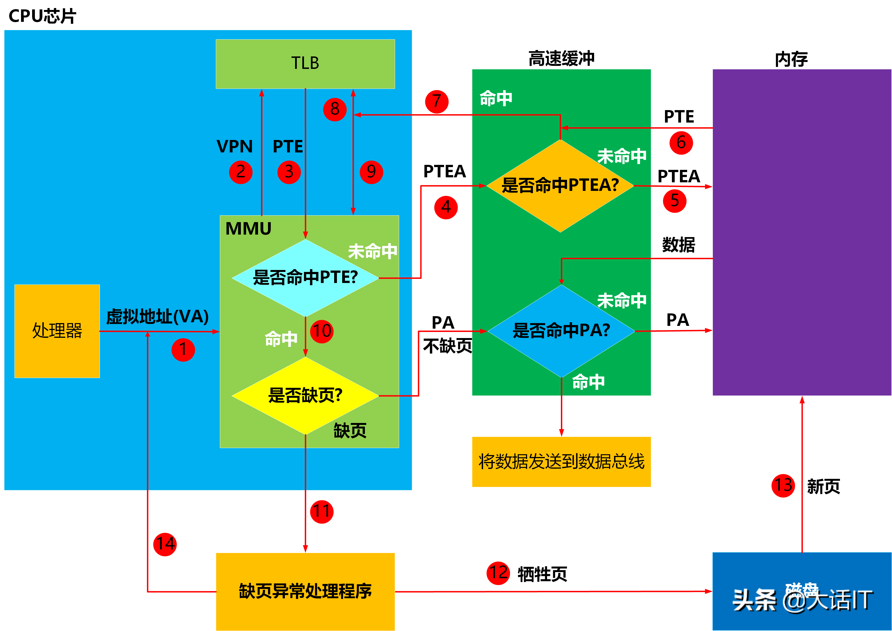

当CPU第一次方位虚拟地址时，虚拟地址所在的虚拟页不在内存中，虚拟页表项(PTE)也不在TLB中，因此，需要执行的步骤比较多

第一次访问虚拟地址

1. 处理器将虚拟地址(VA)送往内存管理单元(MMU)

2. MMU获取虚拟地址中的虚拟页号(VPN)，然后将虚拟页号发给TLB，TLB根据虚拟页号从TLB映射表中查询PTE

3. TLB将查询结果返回给MMU

4. MMU分析查询结果是否有PTE，发现PTE为空，没有命中，因此MMU根据页表基址寄存器(PTBR)中的页表起始地址加上VPN，得出虚拟页表项的物理地址PTEA，然后将这个物理地址送往高速缓存L1

5. L1根据PTEA查询内部的缓冲映射表，发现没有找到PTEA映射的内容PTE，然后向内存请求PTEA下的内容

6. 内存将PTEA下的内容PTE，发送给L1，L1建立了PTEA与PTE的映射关系

7. L1再次根据PTEA查询内部的缓冲映射表，这次找到了，然后将PTE发送给TLB

8～9. TLB收到PTE后，建立了VPN与PTE的映射关系，然后将PTE发给MMU

10. MMU收到PTE后，检查PTE的有效位，看看虚拟页是否在内存中

11. MMU检查PTE后，发现虚拟页不在内存中，因此发送缺页中断给CPU，CPU开始执行缺页中断处理程序

12. 缺页中断处理程序根据页面置换算法，选择出一个已经缓冲的虚拟页作为牺牲页(如果这个虚拟页发生变化，则更新到磁盘中)，将这个牺牲页的PTE的有效位设为0，表示这个牺牲页不在内存了

13. 缺页中断处理程序将缺少的页，从磁盘换入到空闲的物理内存中，设置缺少的虚拟页的有效位为1，更新物理号

14. 缺页中断处理程序执行完毕，跳转到发生缺页的指令处，然后CPU重新执行该指令，重新发出虚拟地址到MMU，跳到了1，开始下一个循环

.png)

第二次访问虚拟地址

1. 处理器将虚拟地址(VA)送往内存管理单元(MMU)

2. MMU获取虚拟地址中的虚拟页号(VPN)，然后将VPN发送给TLB，TLB根据VPN从TLB映射表查询PTE

3. TLB将查询结果返回给MMU

4. MMU分析查询结果是否有PTE，发现PTE有值了，命中了，然后检查PTE的有效位，发现有效位是1，因此不缺页，根据PTE中的物理号加虚拟地址中的VPO计算出指令或者数据的物理地址PA，将PA发送到高速缓存L1

5. L1根据PA查询内部的缓冲映射表，发现没有找到PA映射的内容，然后向内存请求PA下的内容

6. 内存将PA下的内容，发送给L1，L1建立了PA和内容的映射关系

7. L1再次根据PA查询内部的缓冲映射表，这次找到了，然后将数据或指令发送到数据总线，最后CPU从数据总线拿到数据

第三次访问同一个虚拟地址时

虚拟地址对应的物理地址的数据，已经缓存到L1了